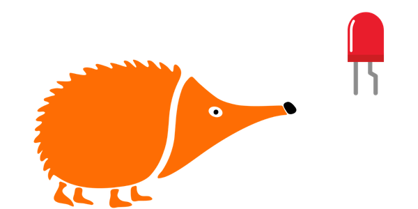

# Hola Mundo

## 1. Qué vamos a hacer

En este ejemplo hacemos parpadear un LED. 

--> GIF o video del funcionamiento?

### 1.1 Qué vamos a aprender

- A realizar nuestro primer programa.
- A realizar una programación cíclica.

### 1.2 Qué componentes vamos a usar

Usaremos el LED rojo.

IMAGEN LUPA LED ROJO

# 2. Programación

Este programa utiliza un bucle continuo para ejecutar la siguiente secuencia lógica, creando un parpadeo constante en el LED Rojo.

**Lógica de programación**:

El programa realiza el ciclo:

1. Activación: Se enciende el LED Rojo.
2. Espera: Se detiene la ejecución del programa durante un segundo.
3. Desactivación: Se apaga el LED Rojo.
4. Espera: Se detiene la ejecución del programa durante un segundo antes de volver a empezar el ciclo.

# 3. Mejóralo

Prueba a realizar algunas de las siguientes modificaciones al proyecto:

1. Prueba a cambiar los tiempos de parpadeo. 
2. Crea una animación en Scratch en la que un LED virtual se encienda y se apague.
 