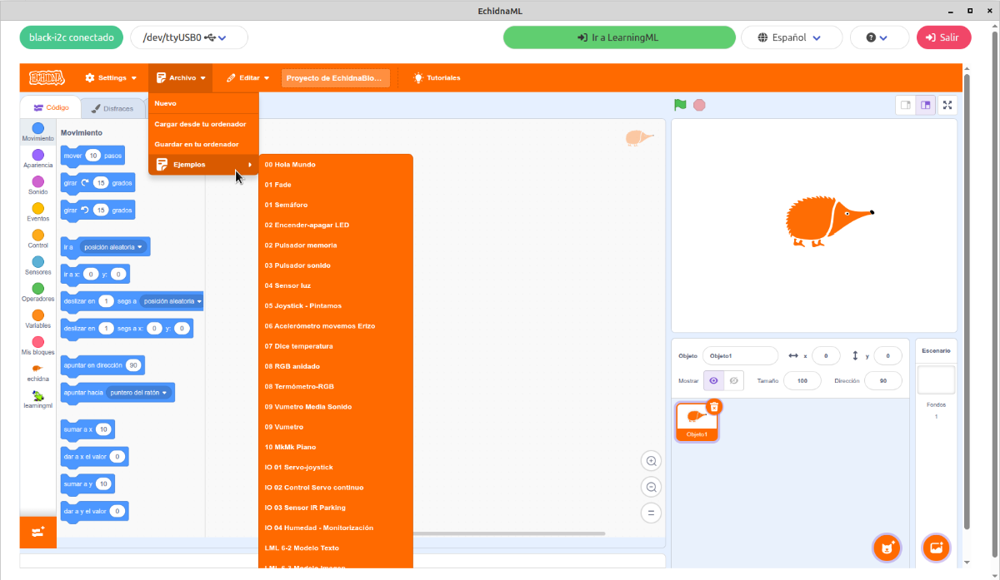

# 1. Introducción

**EchidnaBlack2** (hardware) y **EchidnaML** (software) forman un **sistema integrado** pensado para aprender los fundamentos de la **programación**, la **robótica** y la **inteligencia artificial** (IA). Su objetivo es fomentar el **pensamiento computacional** en Primaria, Secundaria, Bachillerato y F.P., y estimular la creatividad con proyectos prácticos que conectan el mundo digital y el analógico.

El sistema se compone de una **placa** con diversos componentes integrados y un **entorno de programación** diseñado a medida para aprovechar todas sus posibilidades.

{ .img-cabecera }

**EchidnaBlocks** es una versión de **Scratch** que incorpora **bloques** específicos para controlar la placa **EchidnaBlack2** y para integrar modelos de **machine learning** mediante LearningML. Es el entorno con el que vas a programar todos los proyectos de esta guía.

EchidnaBlocks se **comunica** con la placa a través del **puerto serie**, mediante el cable USB: la placa envía el estado de sus **sensores** y tu programa lo procesa y le devuelve cómo deben estar sus **actuadores** (LED, zumbador...).

Esta **guía** te propone una serie de **proyectos sencillos** para dar tus primeros pasos con la placa. No necesitas conocimientos previos de programación, aunque te resultará más fácil si ya conoces **Scratch**. Si quieres ampliar información, consulta el [Manual de EchidnaML y EchidnaBlack](https://echidnaeducacion.github.io/manual/) y la web del proyecto: [www.echidna.es](https://echidna.es/).

Los programas de todos los proyectos de esta guía los puedes encontrar en EchidnaBlocks, en el menú **Archivo → Ejemplos**. Ábrelos para probarlos, estudiarlos y modificarlos.

