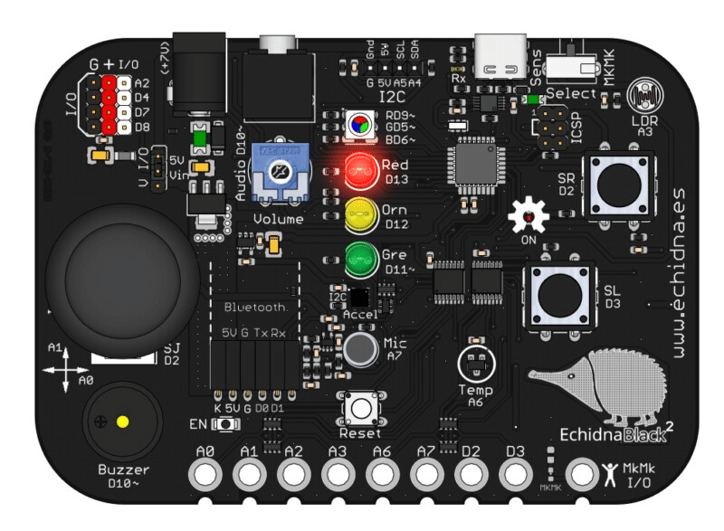
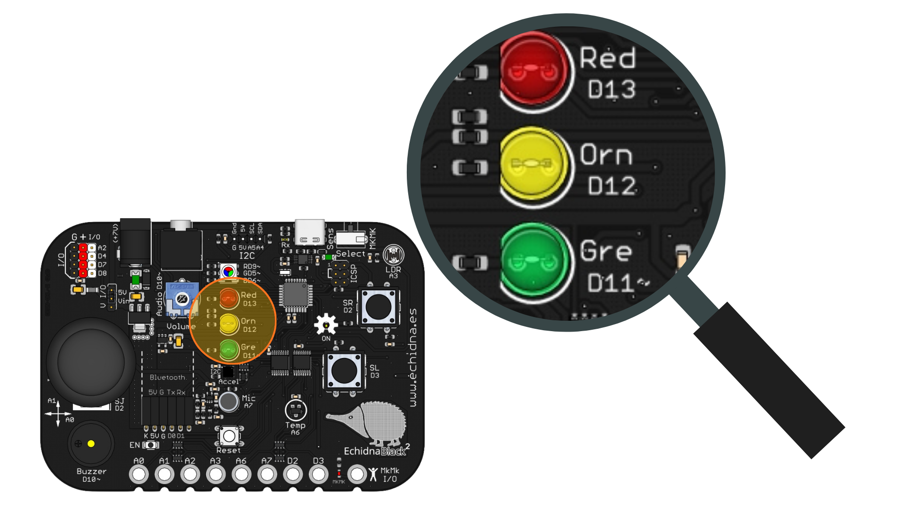

# Hola Mundo

{ .img-cabecera }

## 1. Qué vamos a hacer

En este primer proyecto haremos que el **LED rojo** de la placa EchidnaBlack2 se encienda y se apague de forma continua (parpadeo).

### 1.1 Qué vamos a aprender

* A crear nuestro primer programa en EchidnaML.
* A utilizar bucles infinitos para realizar una **programación cíclica** (tareas que se repiten para siempre).
* A controlar el estado (encendido/apagado) de un componente de la placa.

### 1.2 Qué componentes vamos a usar

Usaremos el LED rojo.

{ .img-lupa }

Para encender y apagar los LED usamos el bloque `encender LED`:

{ .img-bloque }

En el bloque puedes elegir si quieres **encender** o **apagar** el LED y **qué LED**: verde, naranja o rojo.

## 2. Programación

Este programa utiliza un bucle continuo para ejecutar la siguiente secuencia lógica, creando un parpadeo constante en el LED rojo.

Construye el siguiente código arrastrando los bloques a tu área de trabajo:

VIDEO DE PROCESO DE PROGRAMACIÓN

**Lógica de programación**:

El programa empieza con el bloque **`al hacer clic en`** (bandera verde): todo lo que coloquemos debajo se ejecutará cuando pulsemos la bandera verde en EchidnaML.

El bloque **`por siempre`** crea un ciclo infinito que ejecuta los pasos en orden, de arriba a abajo:

1. **`encender LED rojo`**: Envía la señal para encender el LED.
2. **`esperar 1 segundos`**: Mantiene el LED encendido durante un segundo.
3. **`apagar LED rojo`**: Envía la señal para apagar el LED.
4. **`esperar 1 segundos`**: Mantiene el LED apagado durante un segundo antes de volver al paso 1.

## 3. Mejóralo

Una vez que consigas hacer parpadear el LED, prueba a realizar estas modificaciones por tu cuenta:

1. **Ritmo rápido:** Cambia el tiempo de espera a `0.2` segundos. ¿Qué le ocurre al parpadeo? ¿Qué ocurre si sigues bajando el tiempo de espera?
2. **Sombra de señal:** Intenta que el LED esté encendido mucho tiempo (`2` segundos) y apagado muy poco tiempo (`0.1` segundos).
3. **LED virtual en pantalla:** Crea un objeto en EchidnaML que cambie de disfraz para simular en la pantalla el mismo parpadeo que ocurre en la placa real. **Ayuda:** para sincronizar el objeto LED, lo podemos hacer mediante mensajes.
