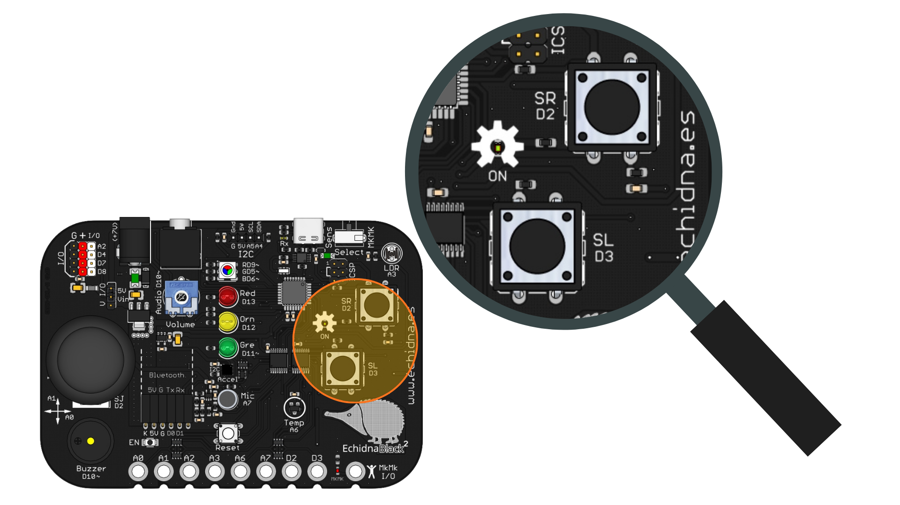
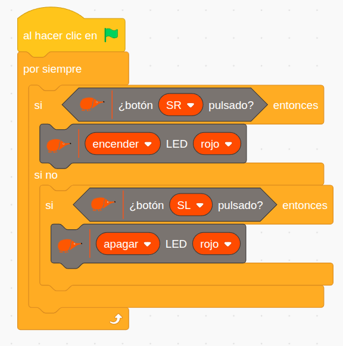
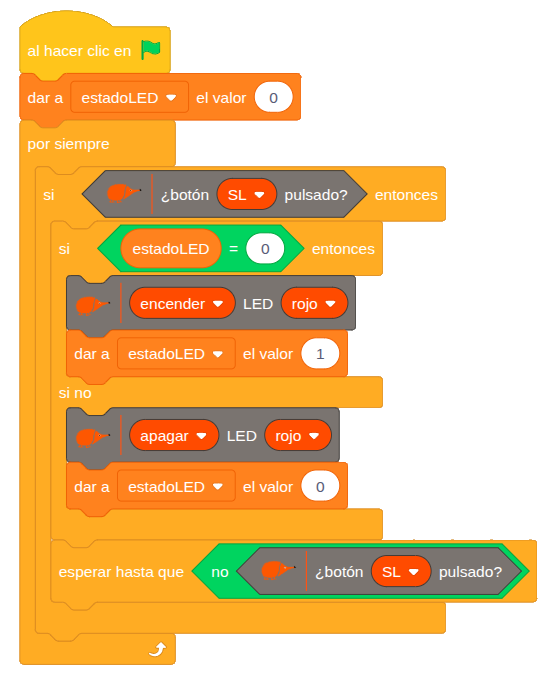

# 2.3 Interruptor de luz

{ .img-cabecera }

## 1. Qué vamos a hacer

Vamos a programar un sistema de encendido y apagado manual con dos botones:

* Al presionar el **pulsador derecho (SR)**, el **LED rojo** se encenderá.
* Al presionar el **pulsador izquierdo (SL)**, el **LED rojo** se apagará.

### 1.1 Qué vamos a aprender

* A leer **entradas digitales** (saber si un botón está presionado o no).
* A diferenciar claramente entre una **Entrada (Input)** y una **Salida (Output)** en robótica:
    * **Entrada (SR y SL):** Detecta la orden del usuario.
    * **Salida (LED rojo):** Produce la respuesta (luz).
* A tomar decisiones en el programa mediante el bloque condicional **`si ... si no`**: si se cumple la condición se ejecuta una parte del programa y, si no, la otra.
* A utilizar **condicionales anidados** (`si ... si no` y dentro otro `si`).
* A controlar el estado de un actuador (LED) mediante eventos físicos (pulsaciones).

### 1.2 Qué vamos a usar

#### Componentes

* **Pulsador SR (Switch Right / Derecho):** Para encender el LED.
* **Pulsador SL (Switch Left / Izquierdo):** Para apagar el LED.
* **LED rojo:** Componente que cambia de estado según el botón pulsado.

{ .img-lupa }

#### Programación

Para leer el estado de los pulsadores usamos el bloque `¿botón SL pulsado?`:

{ .img-bloque }

En el bloque puedes elegir el pulsador **SL** o **SR**. Devuelve **verdadero** (1) si está pulsado y **falso** (0) si no lo está.

## 2. Programamos

El programa comprueba si el pulsador derecho está presionado; en ese caso, enciende el LED rojo. Si no lo está y presionamos el pulsador izquierdo, el LED se apaga.



**Cómo funciona**:

El programa revisa continuamente:

```
SI el pulsador derecho (SR) está presionado:
    --> Enciende el LED rojo inmediatamente.

SI NO (es decir, si SR no está presionado el programa comprueba la segunda condición):
    SI el pulsador izquierdo (SL) está presionado:
        --> Apaga el LED rojo.
```

## 3. Mejóralo

Prueba a realizar algunas de las siguientes modificaciones al proyecto:

1. **Luz cruzada (biestable):** Añade el **LED verde** al programa para que funcionen de forma alterna:
    * Al pulsar **SR**: LED rojo encendido y LED verde apagado.
    * Al pulsar **SL**: LED rojo apagado y LED verde encendido.
2. **LED virtual en pantalla:** Crea un objeto en EchidnaML que cambie de disfraz (encendido/apagado) al mismo tiempo que cambia el LED físico de la placa.
3. **Pulsador con memoria (conmutador):** Programa un solo pulsador (por ejemplo, **SL**) para que funcione como el interruptor de la luz de tu habitación: la primera vez que lo pulsas enciende el LED, y al volverlo a pulsar lo apaga.

**Ayuda:** esta última mejora es más compleja, así que te dejamos una posible solución:



La clave es la variable **`estadoLED`**, que recuerda si el LED está apagado (`0`) o encendido (`1`). Cada vez que pulsamos **SL**, el programa cambia el LED al estado contrario y actualiza la variable. El bloque **`esperar hasta que no ¿botón SL pulsado?`** hace que el programa espere a que soltemos el pulsador; sin él, mientras lo mantenemos pulsado el LED se encendería y apagaría muchas veces seguidas.
