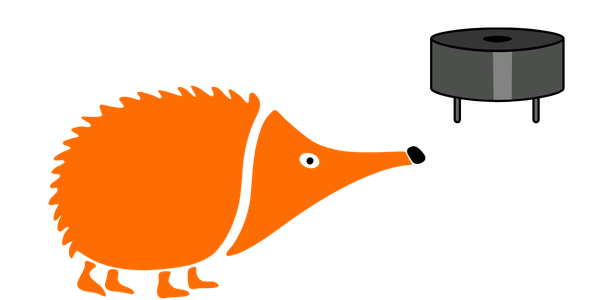
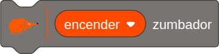
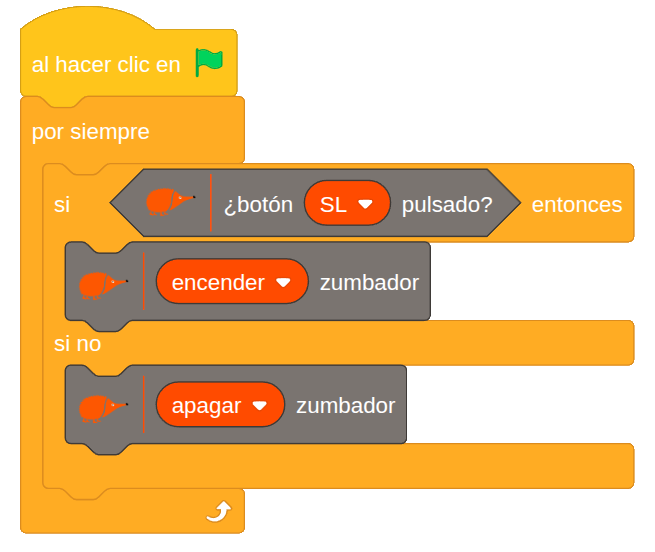

# 2.4 Timbre

{ .img-cabecera }

## 1. Qué vamos a hacer

Vamos a programar un timbre eléctrico: el **zumbador** emitirá un tono sonoro únicamente mientras mantengamos presionado el **pulsador izquierdo (SL)**, y se apagará inmediatamente al soltarlo.

### 1.1 Qué vamos a aprender

* A controlar un actuador de sonido (**zumbador**) mediante un botón de entrada.
* A evaluar estados en tiempo real (`presionado` vs `liberado`).
* A usar el condicional **`si ... si no`** para que el zumbador suene solo mientras el pulsador está presionado.

### 1.2 Qué componentes vamos a usar

* **Pulsador SL (Switch Left / Izquierdo):** Componente de entrada para activar el sonido.
* **Zumbador (Buzzer):** Componente de salida que genera notas o pitidos.

{ .img-lupa }

Para hacer sonar el zumbador usamos el bloque `encender zumbador`:

{ .img-bloque }

En el bloque puedes elegir si quieres **encender** o **apagar** el zumbador. El volumen se ajusta con el potenciómetro **Volume** de la placa.

## 2. Programamos

La programación se basa en revisar continuamente si el pulsador SL está presionado, si lo está se activa el zumbador y, si no, se apaga.



**Lógica de programación**:

El programa revisa continuamente:

```
SI el pulsador SL está presionado:
    --> El zumbador suena.

SI NO (es decir, si SL está liberado):
    --> El zumbador deja de sonar.
```

De esta forma, el zumbador solo se activa mientras el pulsador se mantiene presionado.

## 3. Mejóralo

Prueba a realizar alguna de estas mejoras en tu proyecto:

1. **Alarma intermitente:** Modifica el programa para que, al mantener pulsado **SL**, el sonido no sea continuo, sino que emita pitidos intermitentes tipo alarma (sonido `0.1` segundos, silencio `0.1` segundos).
2. **Emisor de código Morse:** Programa el pulsador **SR** para emitir un tono más agudo que el pulsador **SL**. ¡Intenta combinar pulsaciones cortas y largas para enviar mensajes secretos en código Morse a tus compañeros!
3. **Efecto visual de altavoz (vibración en pantalla):** Crea o selecciona un objeto en EchidnaML con forma de altavoz o campana. Haz que el objeto cambie de tamaño ligeramente o gire de un lado a otro (simulando vibración) mientras el zumbador esté sonando.
