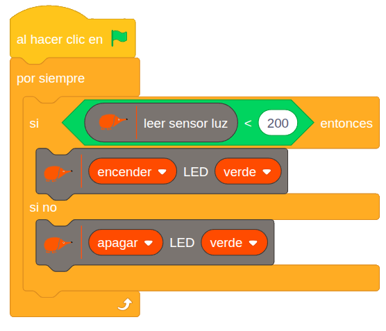

# 2.5 Interruptor crepuscular

{ .img-cabecera }

## 1. Qué vamos a hacer

Vamos a programar un sistema automático similar al de las farolas de la calle: el **LED verde** se encenderá automáticamente cuando la luz ambiental baje (de noche) y se apagará cuando haya suficiente luz (de día).

### 1.1 Qué vamos a aprender

* A programar un **sistema automático** que reaccione al entorno.
* A utilizar el **sensor de luz (LDR)** para medir la iluminación ambiental.
* A usar un **operador de comparación** (`<`) para que el condicional `si ... si no` decida a partir de la lectura de un sensor.
* A trabajar con **umbrales numéricos** para definir estados (día/noche).

### 1.2 Qué vamos a usar

* **Sensor de luz (LDR):** Mide la cantidad de luz que recibe. Cuanto más oscuro esté el entorno, menor será el valor registrado.
* **LED verde:** Funcionará como nuestra luz automática.

 en EchidnaBlack2"){ .img-lupa }

Para leer el sensor de luz usamos el bloque `leer sensor luz`:

{ .img-bloque }

Nos da valores entre **0** (no hay luz) y **1023** (mucha luz). Si marcas la casilla que hay junto al bloque, verás en el escenario el valor que mide en cada momento.

## 2. Programamos

Revisamos continuamente el valor del sensor de luz: si es menor que un cierto umbral, encendemos el LED; en caso contrario, lo apagamos.



**Cómo funciona**:

El programa revisa continuamente:

```
SI el sensor de luz registra valores menores de 200:
    --> Se enciende el LED verde.

SI NO (si registra valores mayores o iguales a 200):
    --> Se apaga el LED verde.
```

El valor 200 actúa como el umbral que define cuándo debe encenderse o apagarse la luz.

## 3. Mejóralo

Prueba a realizar algunas de estas mejoras en tu proyecto de forma autónoma:

1. **Calibra tu aula:** Averigua qué valor lee el sensor de luz en tu mesa y ajusta el umbral exacto para que la luz se encienda solo cuando tapes el sensor con la mano. Para ver en pantalla el valor del sensor de luz, marca la casilla que hay junto al bloque `leer sensor luz`.
2. **Fondo de día y noche:** Añade dos fondos al escenario de EchidnaML (uno soleado y otro nocturno). Haz que el fondo cambie en la pantalla al mismo tiempo que se enciende o apaga el LED en la placa.
3. **Luz blanca:** Sustituye el LED verde por el **LED RGB** para que ilumine más: cuando haya oscuridad, se encenderá en color **blanco**, y cuando haya mucha luz, se apagará. **Pista:** con el bloque `LED R G B`, el blanco se consigue poniendo los tres colores a `255`, y para apagarlo los ponemos a `0`.
