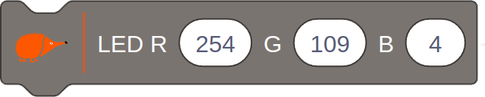
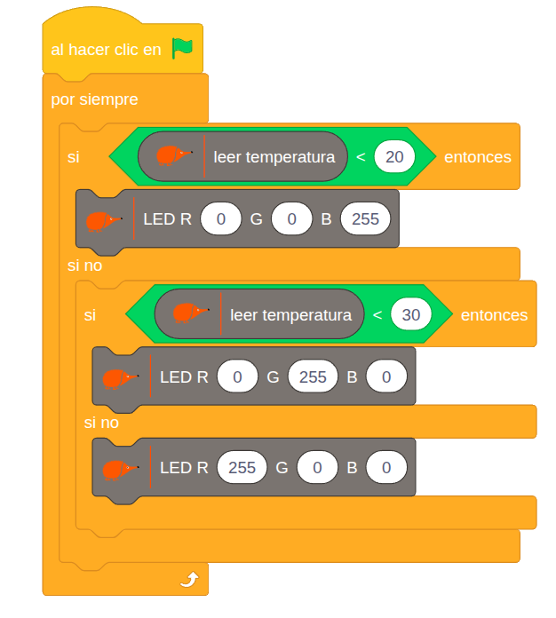

# Mezclamos colores

{ .img-cabecera }

## 1. Qué vamos a hacer

Vamos a construir un **termómetro de colores**: el **LED RGB** de la placa cambiará de color automáticamente según la temperatura ambiente. Se encenderá en **azul** si hace frío, en **verde** si la temperatura es agradable y en **rojo** si hace calor.

### 1.1 Qué vamos a aprender

* A utilizar el **LED RGB** y a **mezclar** sus tres colores (rojo, verde y azul) para conseguir otros.
* A ajustar la **intensidad** de cada color con valores de 0 a 255.
* A usar el **sensor de temperatura** como entrada para controlar un actuador.
* A usar un condicional `si ... si no` **dentro de otro** para distinguir tres zonas de temperatura.

### 1.2 Qué componentes vamos a usar

* **LED RGB:** Componente que tiene dentro tres LED: uno **rojo** (R, *Red*), uno **verde** (G, *Green*) y uno **azul** (B, *Blue*). Al mezclar la luz de los tres podemos conseguir más de 16 millones de colores.
* **Sensor de temperatura:** Mide la temperatura del ambiente en grados Celsius (°C).

{ .img-lupa }

Para controlar el LED RGB usamos el bloque `LED R G B`, en el que damos a cada color un valor entre **0** (apagado) y **255** (máxima intensidad). Por ejemplo, para conseguir el **naranja Echidna** mezclamos mucho rojo (254), algo de verde (109) y casi nada de azul (4):

{ .img-bloque }

## 2. Programación

Revisamos continuamente la temperatura y encendemos el LED RGB de un color según la zona en la que esté: para el azul solo damos valor al canal B, para el verde solo al G y para el rojo solo al R.



**Lógica de programación**:

El programa revisa continuamente:

```
SI la temperatura es menor de 20 °C (zona fría):
    --> El LED RGB se ilumina en azul.

SI NO:
    SI la temperatura es menor de 30 °C (entre 20 °C y 30 °C, zona agradable):
        --> El LED RGB se ilumina en verde.

    SI NO (30 °C o más, zona caliente):
        --> El LED RGB se ilumina en rojo.
```

El segundo `si ... si no` solo se comprueba cuando la temperatura no es menor de 20 °C. Así, con dos condicionales, distinguimos tres zonas.

## 3. Mejóralo

Prueba a realizar algunas de estas mejoras en tu proyecto de forma autónoma:

1. **El echidna avisa:** Haz que el echidna del escenario diga "¡Qué frío!", "¡Qué bien se está!" o "¡Qué calor!" según el color que se encienda.
2. **Tu paleta de colores:** Prueba a mezclar colores en el bloque `LED R G B` y descubre qué valores necesitas para conseguir **amarillo**, **morado**, **blanco** o tu color favorito. Después úsalos para añadir una zona **muy fría** (menos de 10 °C) y otra **muy caliente** (más de 35 °C).
3. **Arcoíris:** Crea una variable y usa un bucle `repetir` para que el LED RGB pase poco a poco del azul al rojo, sumando 1 al rojo y restando 1 al azul en cada vuelta.
