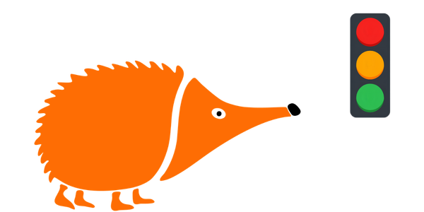
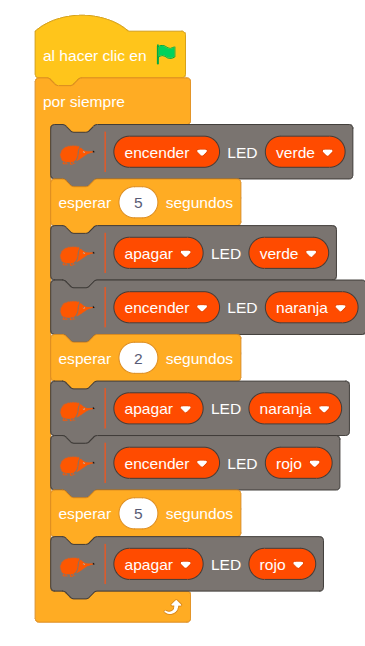

# Semáforo

{ .img-cabecera }

## 1. Qué vamos a hacer

Vamos a realizar un semáforo en el que el LED verde se enciende durante 5 segundos, luego se enciende el LED naranja durante 2 segundos y finalmente el LED rojo durante 5 segundos. El ciclo se repite continuamente.

--> GIF del funcionamiento?

### 1.1 Qué vamos a aprender

* A diseñar **secuencias temporizadas** (eventos que ocurren en un orden y tiempo exactos).
* A controlar múltiples componentes digitales (LED) de forma coordinada.
* A estructurar un ciclo de estados infinito (**programación cíclica**).

### 1.2 Qué componentes vamos a usar

* **LED verde:** Fase de paso.
* **LED naranja:** Fase de precaución.
* **LED rojo:** Fase de detención.

{ .img-lupa }

## 2. Programación

La programación se basa en una secuencia cíclica donde cada LED permanece encendido durante un tiempo específico y luego pasa al siguiente estado de forma automática.

**Lógica de programación**:

1. El LED verde se enciende durante 5 segundos. Al finalizar este tiempo, se apaga.
2. El LED naranja se enciende durante 2 segundos, y luego se apaga.
3. El LED rojo se enciende durante 5 segundos. Transcurrido este tiempo, se apaga.

Luego, el ciclo vuelve a comenzar con la luz verde y se repite de forma indefinida.

## 3. Mejóralo

Prueba a perfeccionar tu semáforo con algunas de estas tres mejoras que te proponemos:

1. **Semáforo virtual en pantalla:** Diseña un objeto "Semáforo" en EchidnaML con tres disfraces (Verde, Naranja, Rojo). Programa el objeto para que cambie de disfraz en la pantalla al mismo tiempo que cambian los LED en la placa real.
2. **Naranja intermitente:** Modifica la fase intermedia para que el LED naranja no se quede fijo, sino que **parpadee 3 veces rápidas** (encendido `0.3` segundos / apagado `0.3` segundos) antes de pasar al rojo.
3. **Semáforo sonoro adaptado:** Añade el **zumbador** de la placa para avisar a personas con discapacidad visual:
    * **Fase verde:** Sonido intermitente lento.
    * **Fase roja:** Sonido continuo o apagado.
