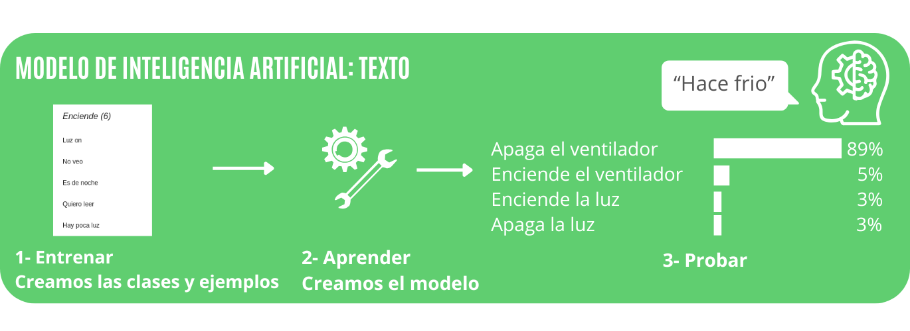
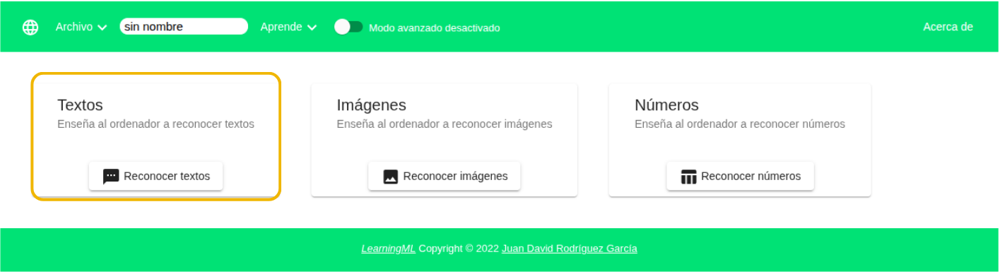
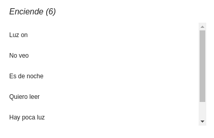
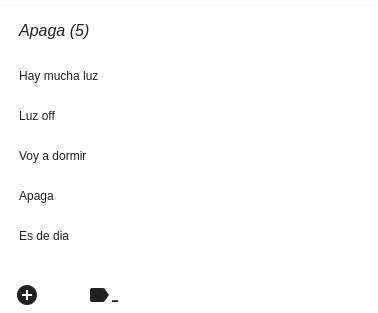
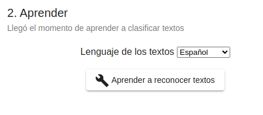
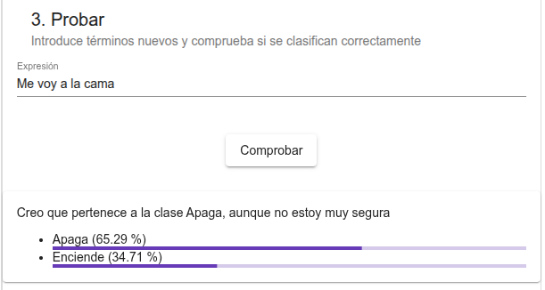
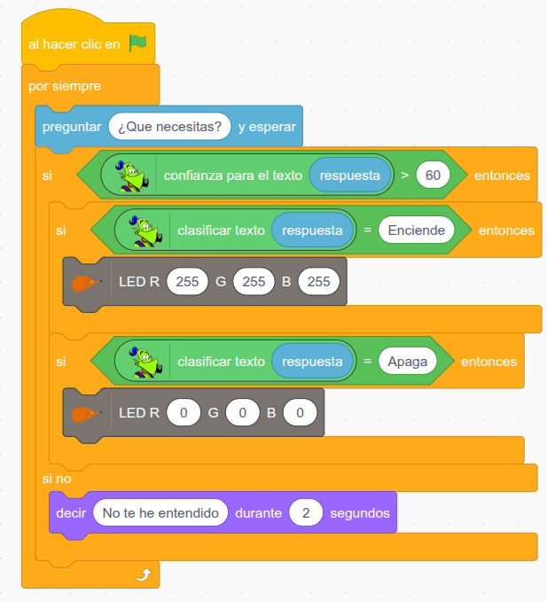

# 3.1 Asistente virtual



## 1. Qué vamos a hacer

Vamos a crear un **asistente virtual** que entiende lo que le escribimos. Le pediremos con nuestras propias palabras que encienda o apague la luz, y el asistente encenderá o apagará el **LED RGB** de la placa EchidnaBlack2.

Para que el asistente entienda frases que nunca ha visto, crearemos con **LearningML** un **modelo de texto**: le enseñaremos ejemplos de frases para encender y para apagar la luz, y él aprenderá a reconocerlas.

### 1.1 Qué vamos a aprender

* A crear un **modelo de machine learning** que clasifica **textos**.
* A organizar los datos en **clases** y a añadir **ejemplos** a cada una.
* A **entrenar**, **probar** y **mejorar** un modelo.
* A usar la **confianza** del modelo para decidir si nos fiamos de su respuesta.
* A usar el modelo en EchidnaBlocks para controlar la placa.

### 1.2 Qué componentes vamos a usar

Usaremos el **LED RGB** de la placa y el **teclado** del ordenador para escribir las órdenes.

{ .img-lupa }

Para usar el modelo en nuestro programa usamos el bloque `clasificar texto`:

{ .img-bloque }

Le damos un **texto** y nos devuelve la **clase** que el modelo considera más probable; en nuestro caso, **Enciende** o **Apaga**.

## 2. Entrenamos el modelo

Abrimos LearningML y elegimos trabajar con datos de tipo **texto**.



### 2.1 Entrenar: clases y ejemplos

Creamos dos **clases** y añadimos a cada una ejemplos de frases:

* **Enciende:** frases que indican que queremos luz, por ejemplo "Luz on", "No veo", "Es de noche", "Quiero leer" o "Hay poca luz".
* **Apaga:** frases que indican que no la necesitamos, por ejemplo "Luz off", "Apaga", "Hay mucha luz", "Voy a dormir" o "Es de día".

<div class="img-row" markdown="1">
{ width="260" }

{ width="260" }
</div>

La **calidad** del modelo depende de los **datos**: cuantos más ejemplos, y mejor elegidos, añadas a cada clase, mejor clasificará las frases nuevas.

### 2.2 Aprender

Pulsamos el botón **Aprender a reconocer textos**. El algoritmo analiza los ejemplos y construye un **modelo** capaz de clasificar textos que no ha visto antes. A esto lo llamamos **aprendizaje a partir de datos**.

{ width="201" }

### 2.3 Probar

Escribimos frases **distintas** de los ejemplos y comprobamos en qué clase las coloca el modelo y con qué **confianza** (en %). Así comprobamos que el modelo ha aprendido y no solo ha memorizado los ejemplos.



En el ejemplo, el modelo clasifica la frase "Me voy a la cama", que no está entre los ejemplos de entrenamiento, como **Apaga** con un 65 % de confianza.

Si el modelo se equivoca o la confianza es baja, volvemos a **2.1 Entrenar**: revisamos los ejemplos, añadimos otros nuevos y aprendemos de nuevo.

## 3. Programación

Cuando el modelo funcione bien, abrimos **EchidnaBlocks** y construimos el programa con los bloques de LearningML y los de la placa:



**Lógica de programación**:

El echidna pregunta "¿Qué necesitas?" y espera nuestra respuesta. Antes de actuar, comprueba la **confianza** del modelo para esa respuesta: solo nos hace caso si es mayor de 60.

```
SI la confianza es mayor de 60:
    SI la clase es "Enciende":
        --> El LED RGB se enciende en blanco (R 255, G 255, B 255).
    SI la clase es "Apaga":
        --> El LED RGB se apaga (R 0, G 0, B 0).
SI NO:
    --> El echidna dice "No te he entendido".
```

Como todo está dentro de un bucle `por siempre`, el echidna vuelve a preguntar "¿Qué necesitas?", listo para una nueva orden.

## 4. Mejóralo

Prueba a realizar algunas de estas mejoras en tu proyecto de forma autónoma:

1. **Más exigente:** Cambia el 60 de confianza por 80. ¿Qué ocurre con las frases que antes entendía con dudas?
2. **Entrénalo mejor:** Busca frases que el asistente no entienda o clasifique mal, añádelas como ejemplos a su clase y vuelve a entrenar el modelo. ¿Sube la confianza?
3. **Elige el color:** Añade las clases **Rojo**, **Verde** y **Azul** para que, además de encender y apagar, el asistente cambie el color del LED RGB según lo que le pidas.
