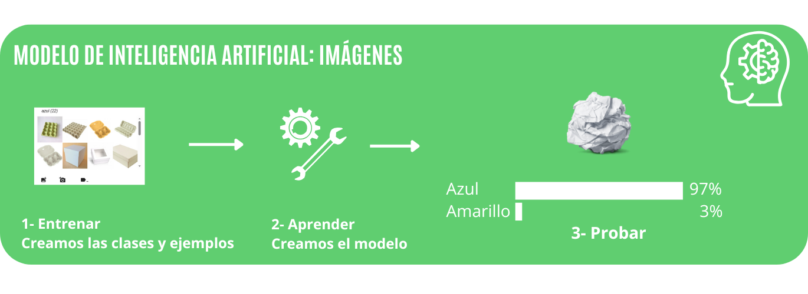
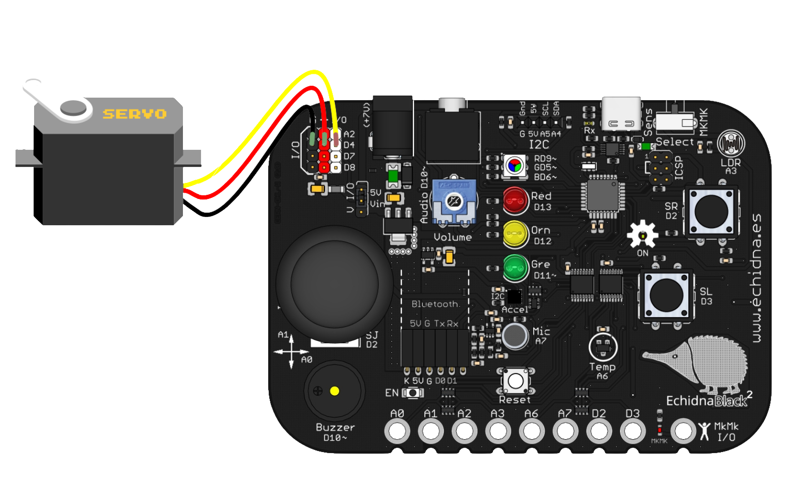
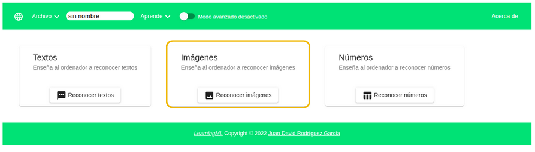
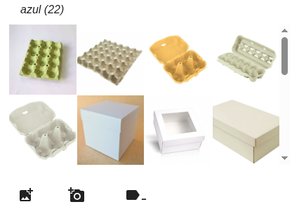
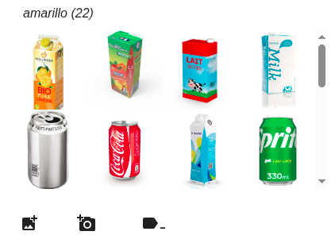
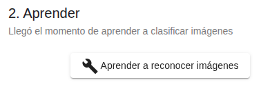
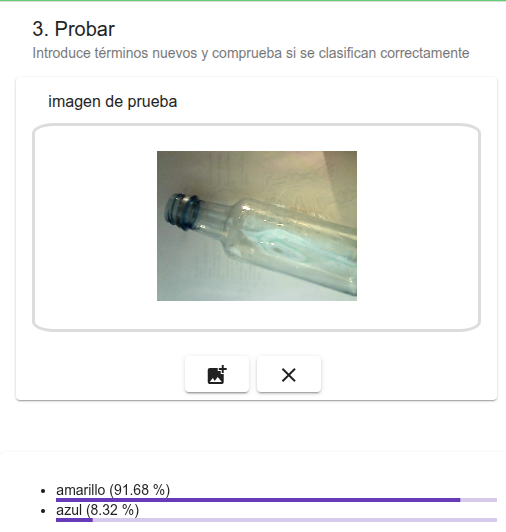
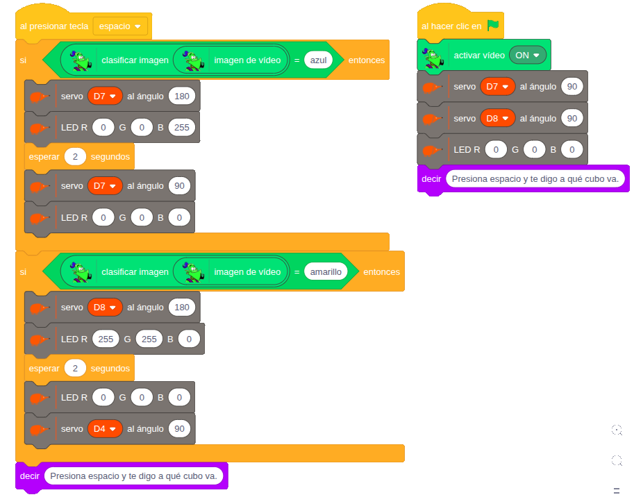

# 3.2 Clasificador de residuos



## 1. Qué vamos a hacer

Vamos a construir un **clasificador de residuos** que nos ayuda a reciclar. Enseñamos un residuo a la **cámara** y el sistema decide si va al contenedor **amarillo** (envases) o al **azul** (papel y cartón). Después enciende el **LED RGB** del color del contenedor y **abre** su tapa con un **servomotor**.

Para que reconozca los residuos, crearemos con **LearningML** un **modelo de imágenes**: le enseñaremos fotos de envases y de cartones, y él aprenderá a distinguirlos.

### 1.1 Qué vamos a aprender

* A crear un **modelo de machine learning** que clasifica **imágenes**.
* A preparar buenas **imágenes de entrenamiento** para cada **clase**.
* A usar la **cámara** (webcam) en EchidnaBlocks para clasificar lo que ve.
* A mover un **servomotor de posición** a un ángulo concreto.

### 1.2 Qué componentes vamos a usar

Usaremos la **cámara** del ordenador, el **LED RGB** de la placa y dos **servomotores de posición** conectados a los pines **D7** (contenedor azul) y **D8** (contenedor amarillo).

{ width="320" }

Presta atención al conectar los cables: Vcc, GND y señal se indican con los colores rojo, negro y amarillo. Como vamos a conectar **dos servomotores**, usa alimentación externa y coloca el selector de alimentación en la posición **Vin**.

Para usar el modelo en nuestro programa usamos el bloque `clasificar imagen`:

{ .img-bloque }

Le damos una **imagen** (en nuestro caso, la de la cámara, con el bloque `imagen de vídeo`) y nos devuelve la **clase** más probable: **azul** o **amarillo**.

## 2. Entrenamos el modelo

Abrimos LearningML y elegimos trabajar con datos de tipo **imágenes**.



### 2.1 Entrenar: clases y ejemplos

Creamos dos **clases**, **azul** y **amarillo**, y añadimos a cada una imágenes de residuos, desde un archivo o haciendo fotos con la cámara:

* **azul:** papel y cartón, por ejemplo hueveras y cajas de cartón.
* **amarillo:** envases, por ejemplo briks y latas.

<div class="img-row" markdown="1">
{ width="260" }

{ width="260" }
</div>

Para que el modelo aprenda bien, añade **muchos residuos distintos** a cada clase (en el ejemplo, 22 imágenes por clase), vistos desde varias posiciones.

### 2.2 Aprender

Pulsamos el botón **Aprender a reconocer imágenes**. El algoritmo analiza las imágenes y construye un modelo capaz de reconocer imágenes parecidas, pero distintas. Con imágenes este proceso puede tardar **varios segundos**, y más cuantas más imágenes hayamos añadido.

{ width="200" }

### 2.3 Probar

Enseñamos a la cámara residuos **nuevos**, que no hemos usado en el entrenamiento, y comprobamos en qué clase los coloca el modelo y con qué **confianza**.

{ width="300" }

En el ejemplo, el modelo clasifica la imagen de una botella como **amarillo** con un 91,68 % de confianza.

Si el modelo se equivoca, volvemos a **2.1 Entrenar**: añadimos más imágenes o revisamos las que tenemos y aprendemos de nuevo.

## 3. Programación

Cuando el modelo funcione bien, abrimos **EchidnaBlocks** y construimos el programa:



**Lógica de programación**:

**Configuración inicial:** al hacer clic en la bandera verde, activamos la cámara, colocamos los dos servos a 90° (tapas cerradas) y apagamos el LED RGB. El echidna dice "Presiona espacio y te digo a qué cubo va.".

Al pulsar la tecla **espacio**, el programa clasifica la imagen de la cámara:

```
SI la clase es "azul":
    --> El servo D7 se mueve a 180° (abre el contenedor azul).
    --> El LED RGB se ilumina en azul (R 0, G 0, B 255).
    --> Espera 2 segundos, cierra el contenedor (servo D7 a 90°) y apaga el LED.

SI la clase es "amarillo":
    --> El servo D8 se mueve a 180° (abre el contenedor amarillo).
    --> El LED RGB se ilumina en amarillo (R 255, G 255, B 0).
    --> Espera 2 segundos, cierra el contenedor (servo D8 a 90°) y apaga el LED.
```

Después, el echidna vuelve a decir "Presiona espacio y te digo a qué cubo va.".

## 4. Mejóralo

Prueba a realizar algunas de estas mejoras en tu proyecto de forma autónoma:

1. **Dímelo en pantalla:** Haz que el echidna diga a qué contenedor va el residuo ("¡Al amarillo!" o "¡Al azul!").
2. **Solo si está seguro:** Usa el bloque `confianza para la imagen` para que solo abra un contenedor si la confianza es mayor de 70; si no, el echidna dirá "No estoy seguro, prueba otra vez".
3. **Contenedor verde:** Añade la clase **verde** (vidrio) con imágenes de botellas y tarros, un tercer servomotor en el pin **D4** y el LED RGB en verde.
