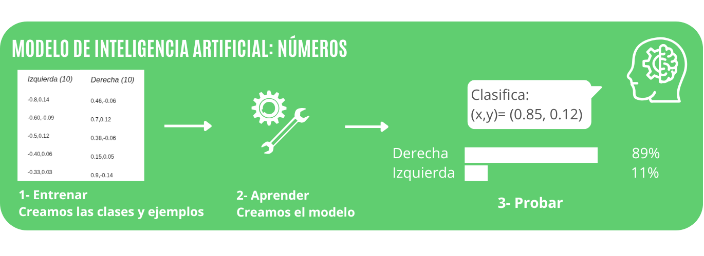
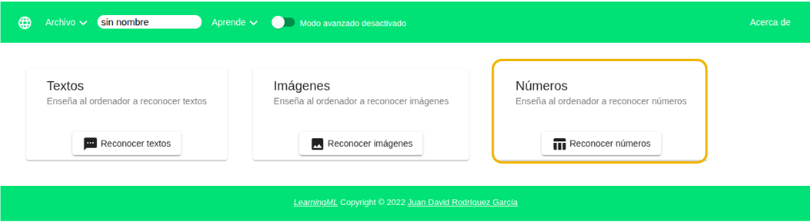
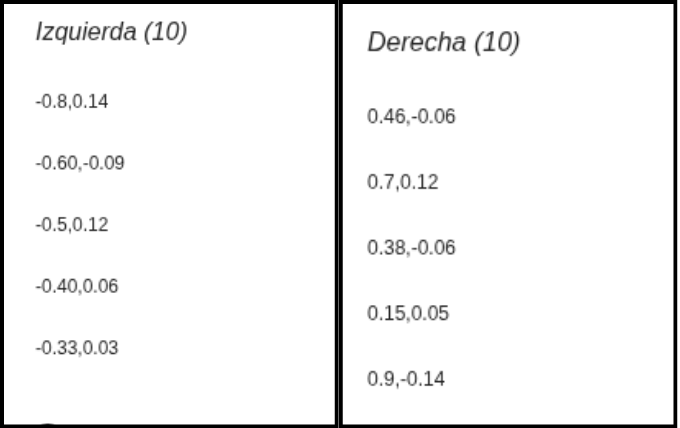
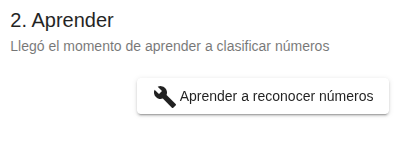
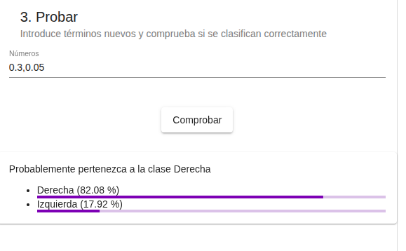
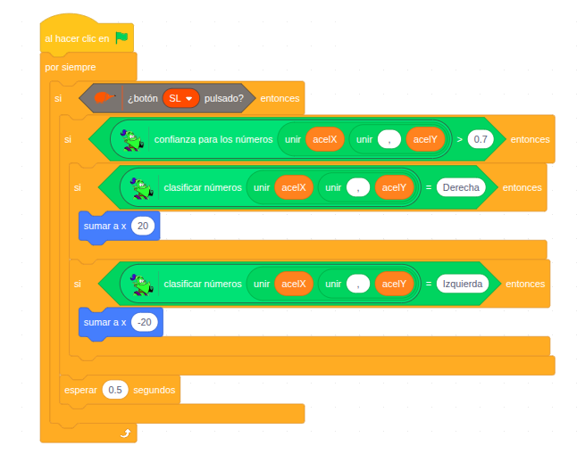

# 3.3 Mando de inclinación



## 1. Qué vamos a hacer

Vamos a convertir la placa EchidnaBlack2 en un **mando**: al inclinarla hacia la **derecha** o hacia la **izquierda** y pulsar **SL**, el echidna se desplazará por el escenario en esa dirección.

Para saber hacia dónde inclinamos la placa, crearemos con **LearningML** un **modelo de números**: le enseñaremos los valores que da el **acelerómetro** en cada posición, y él aprenderá a reconocerlas.

### 1.1 Qué vamos a aprender

* A crear un **modelo de machine learning** que clasifica **números**.
* A recoger **datos** de un sensor para entrenar un modelo.
* A introducir ejemplos con **varias columnas** (en nuestro caso, los ejes X e Y del acelerómetro).
* A usar el modelo en EchidnaBlocks para controlar un personaje.

### 1.2 Qué componentes vamos a usar

Usaremos el **acelerómetro** de la placa, que mide su inclinación, y el pulsador **SL**.

{ .img-lupa }

Para usar el modelo en nuestro programa usamos el bloque `clasificar números`:

{ .img-bloque }

Le damos un **conjunto de números separados por comas** y nos devuelve la **clase** más probable; en nuestro caso, **Derecha** o **Izquierda**.

## 2. Entrenamos el modelo

Abrimos LearningML y elegimos trabajar con datos de tipo **números**.



### 2.1 Entrenar: clases y ejemplos

Primero elegimos el **número de columnas** de cada ejemplo. Elegimos **2**, porque cada ejemplo tendrá los valores del acelerómetro en los ejes **X** e **Y**.

Creamos dos **clases**, **Derecha** e **Izquierda**, y añadimos a cada una ejemplos. Cada ejemplo es una pareja de números separados por una **coma**: primero el eje X y después el eje Y.

{ width="500" }

Para conseguir los ejemplos, inclina la placa y anota los valores del acelerómetro. Puedes verlos en el escenario marcando la casilla que hay junto al bloque `leer acelerómetro`. Al inclinar hacia la izquierda, el eje X da valores **negativos** (hasta -1), y hacia la derecha, **positivos** (hasta 1). Recoge ejemplos con inclinaciones **suaves** y **fuertes**.

### 2.2 Aprender

Pulsamos el botón **Aprender a reconocer números**. El algoritmo analiza los ejemplos y construye un modelo capaz de clasificar números nuevos.

{ width="300" }

### 2.3 Probar

Escribimos parejas de números **nuevas**, parecidas a los ejemplos pero distintas, y comprobamos en qué clase las coloca el modelo y con qué **confianza**.

{ width="400" }

En el ejemplo, el modelo clasifica `0.3,0.05` como **Derecha** con un 82,08 % de confianza.

Si el modelo se equivoca, volvemos a **2.1 Entrenar**: añadimos más ejemplos o revisamos los que tenemos y aprendemos de nuevo.

## 3. Programación

Cuando el modelo funcione bien, abrimos **EchidnaBlocks** y construimos el programa:



**Lógica de programación**:

El programa revisa continuamente el pulsador **SL**. Cuando lo pulsamos, une los valores `acelX` y `acelY` del acelerómetro con una coma (bloque `unir`) y se los da al modelo para que los clasifique. Antes de mover el echidna, comprueba la **confianza**:

```
SI está pulsado SL:
    SI la confianza es suficiente:
        SI la clase es "Derecha":
            --> El echidna se desplaza 20 pasos a la derecha (sumar a x 20).
        SI la clase es "Izquierda":
            --> El echidna se desplaza 20 pasos a la izquierda (sumar a x -20).
    --> Espera 0.5 segundos.
```

## 4. Mejóralo

Prueba a realizar algunas de estas mejoras en tu proyecto de forma autónoma:

1. **Pasos de gigante:** Cambia los 20 pasos y el tiempo de espera para que el echidna se mueva más rápido o más despacio.
2. **Placa quieta:** Añade la clase **Quieta** con ejemplos de la placa en horizontal, para que el echidna no se mueva cuando no la inclinas.
3. **Cuatro direcciones:** Añade las clases **Adelante** y **Atrás** (inclinando la placa en el eje Y) para que el echidna también se mueva hacia arriba y hacia abajo.
