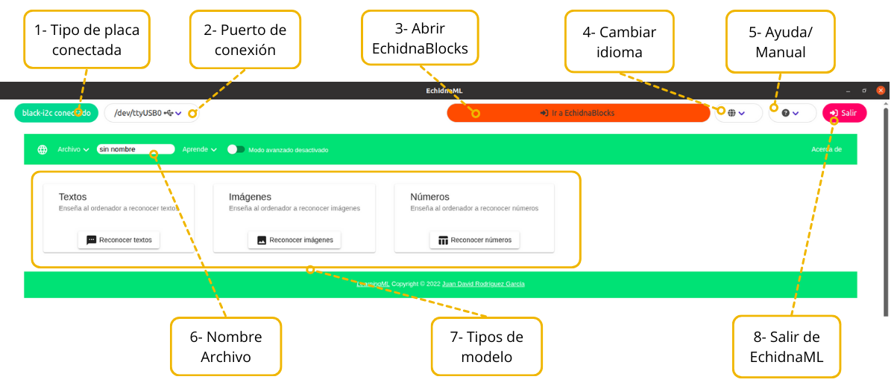
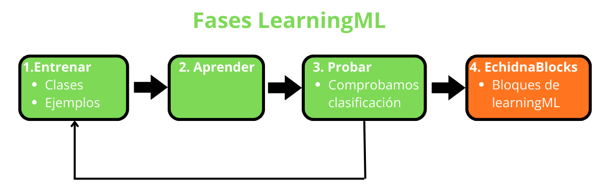

# 3. Proyectos con IA

**EchidnaML** integra **LearningML**, una **plataforma educativa** diseñada para aprender los fundamentos del **machine learning** (aprendizaje automático) de forma sencilla y visual. Esto nos permite incorporar **inteligencia artificial** a nuestros proyectos con la placa EchidnaBlack2.

En estos proyectos crearemos **modelos** que clasifican **textos**, **imágenes** y **números**, y después los usaremos en nuestros programas con los bloques de LearningML de EchidnaBlocks. Así entenderemos cómo se **entrenan** los modelos, qué **datos** necesitan, cómo influyen los **sesgos** y cómo se usan después para tomar **decisiones**.

## Conceptos clave

* **Modelo:** lo que construye el ordenador a partir de los ejemplos para clasificar datos nuevos.
* **Clase:** cada una de las categorías en las que el modelo puede clasificar un dato (por ejemplo, Enciende y Apaga).
* **Ejemplo:** cada dato que añadimos a una clase para enseñar al modelo cómo es esa clase.
* **Confianza:** el porcentaje de seguridad que tiene el modelo en su respuesta.

## El entorno de LearningML

Para abrir LearningML pulsamos el botón **Ir a LearningML** de EchidnaBlocks, y para volver, el botón **Ir a EchidnaBlocks**.

En esta guía usaremos sobre todo:

* **Nombre del archivo (6):** el nombre con el que guardamos el modelo.
* **Tipos de modelo (7):** elegimos si queremos reconocer **textos**, **imágenes** o **números**.
* **Ir a EchidnaBlocks (3):** volvemos a EchidnaBlocks para usar el modelo en nuestro programa.

## Fases para crear un modelo

Para crear un modelo seguimos siempre estas fases:

1. **Entrenar**: creamos las clases e introducimos los ejemplos.
2. **Aprender**: creamos el modelo.
3. **Probar**: comprobamos que el modelo clasifica correctamente. Si no lo hace, volvemos a la fase **Entrenar**.
4. **Programar**: abrimos **EchidnaBlocks** y usamos los bloques de LearningML para construir nuestra aplicación.

## Proyectos

1. [Asistente virtual](01-asistente-virtual.md): un modelo de **texto** que entiende nuestras órdenes para encender y apagar la luz.
2. [Clasificador de residuos](02-clasificador-residuos.md): un modelo de **imágenes** que reconoce con la cámara a qué contenedor va cada residuo.
3. [Mando de inclinación](03-mando-inclinacion.md): un modelo de **números** que reconoce, con el acelerómetro, hacia dónde inclinamos la placa.

## Estructura de los proyectos

Todos los proyectos con IA siguen la misma estructura:

1. **Qué vamos a hacer**: descripción del proyecto, qué vamos a aprender y qué vamos a usar.
2. **Entrenamos el modelo**: creamos las clases y los ejemplos, el modelo aprende y lo probamos.
3. **Programamos**: el programa de bloques que usa el modelo y cómo funciona.
4. **Mejóralo**: propuestas para ampliar el proyecto por tu cuenta.
