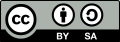

# 4. Licencia

{ width="176" }

**Proyectos de inicio con EchidnaML**: proyectos sencillos para iniciarse con **EchidnaML** y la placa **EchidnaBlack2**.

**Autoría:** Echidna Educación.

Este recurso se publica bajo la licencia [Creative Commons Reconocimiento-CompartirIgual 4.0 Internacional (CC BY-SA 4.0)](https://creativecommons.org/licenses/by-sa/4.0/deed.es). Esto significa que puedes:

* **Compartir:** copiar y redistribuir el material en cualquier medio o formato.
* **Adaptar:** remezclar, transformar y crear a partir del material con cualquier finalidad, incluso comercial.

Siempre que cumplas estas condiciones:

* **Reconocimiento:** debes citar la autoría (Echidna Educación), enlazar la licencia e indicar si has hecho cambios.
* **Compartir igual:** si remezclas, transformas o creas a partir del material, debes difundir tu obra con la misma licencia.
