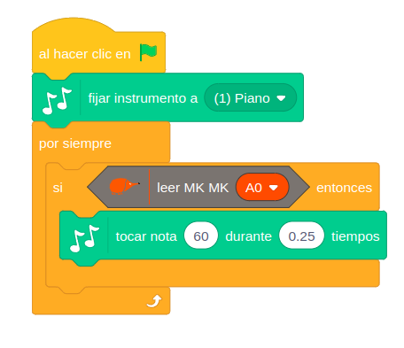

# Makey Makey


## 1. Qué vamos a hacer

Vamos a convertir la entrada **MkMk A0** de nuestra placa en una tecla de piano táctil. Cada vez que toques la entrada (o un objeto conductor conectado a ella), el ordenador emitirá una nota musical.

### 1.1 Qué vamos a aprender

* A detectar la conductividad eléctrica de objetos cotidianos usando el **modo Makey Makey (MkMk)**.
* A conectar cables de cocodrilo en los conectores externos de la placa.
* A entender cómo funciona un **circuito cerrado** (hacer masa / GND).
* A reproducir notas musicales y sonidos desde el software.

### 1.2 Qué componentes vamos a usar

* **Entrada MkMk A0:** Conector táctil para detectar pulsaciones o conductividad.
* **Pin GND (Masa / Común):** Indispensable para cerrar el circuito con tu cuerpo. Aunque en la placa aparece serigrafiado como **MkMk I/O** (en el extremo derecho de la fila de conectores), en este proyecto funciona como GND.
* **Cables de cocodrilo:** Para conectar objetos externos (frutas, plastilina, papel de aluminio, etc.).

**¡ATENCIÓN!** Para que funcione el modo MkMk debemos poner el selector del modo de funcionamiento hacia la derecha, y se nos encenderá el LED testigo en la parte inferior.


En la imagen, la fruta está conectada a la entrada **A0** y la pulsera al conector **MkMk I/O** (GND). Al tocar la fruta con la mano, la corriente pasa a través de tu cuerpo, el circuito se cierra y la placa detecta el contacto.

## 2. Programación

Primero elegimos el instrumento con el bloque **`fijar instrumento a (1) Piano`**. Después revisamos continuamente la entrada MkMk A0: **cuando detecta contacto**, se reproduce la **nota 60** (que corresponde a la nota *Do central* del piano) durante **`0.25` tiempos** (con el tempo por defecto, 60 pulsos por minuto, equivale a un cuarto de segundo).



**Lógica de programación**:

El programa revisa continuamente:

```
SI la entrada MkMk A0 detecta contacto:
    --> Suena la nota 60 (Do central) durante 0.25 tiempos.
```

Si no hay contacto, no ocurre nada y el programa vuelve a comprobar la entrada.

## 3. Mejóralo

Prueba a realizar algunas de las siguientes modificaciones al proyecto:

1. **Animación en pantalla:** Añade un objeto en EchidnaML (un instrumento o una nota musical) que cambie de disfraz, baile o salte en la pantalla cada vez que suene la nota.
2. **Luz y sonido:** Haz que el **LED RGB** se ilumine de un color distinto cada vez que toques una tecla de tu piano MkMk.
3. **Escala musical:** Utiliza los otros conectores disponibles (**A1, A2, A3**) con otros cables para programar diferentes notas (por ejemplo: Do=60, Re=62, Mi=64, Fa=65) y crea un mini teclado completo.
