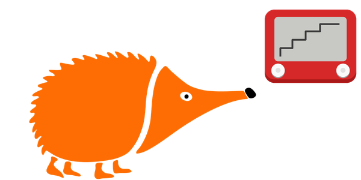
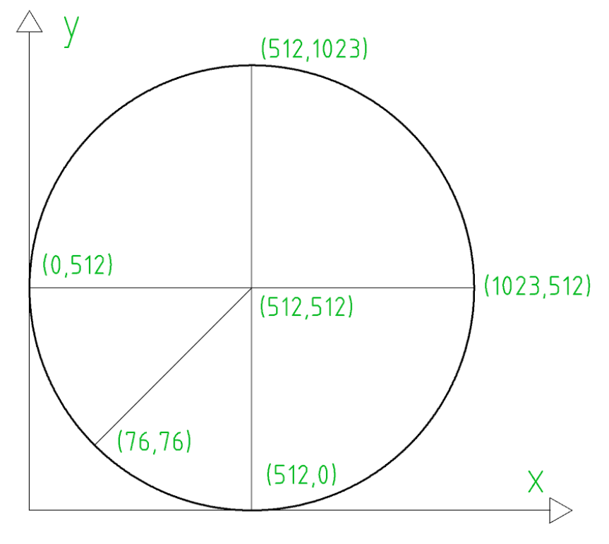
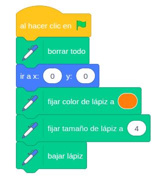
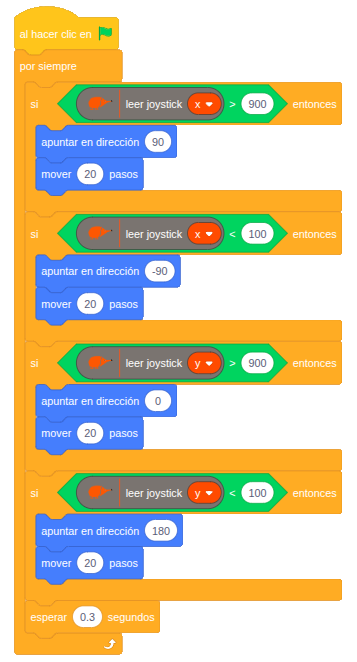

# Telesketch

{ .img-cabecera }

--> Video del funcionamiento

## 1. Qué vamos a hacer

Vamos a convertir la pantalla de EchidnaML en un **Telesketch**, la pizarra mágica que dibuja líneas con dos ruedas. En nuestro caso usaremos el **joystick** de la placa: al mover la palanca hacia un lado, el **lápiz** dibujará una línea en el escenario en esa misma dirección.

### 1.1 Qué vamos a aprender

* A utilizar el **joystick** y sus dos ejes: horizontal (**X**) y vertical (**Y**).
* A leer **valores analógicos** entre 0 y 1023.
* A usar la extensión **Lápiz** de EchidnaML para dibujar en el escenario.
* A combinar varios condicionales `si` con **umbrales** (`>` y `<`) para detectar hacia dónde movemos la palanca.
* A mover un objeto por el escenario usando **direcciones** y **coordenadas**.

### 1.2 Qué componentes vamos a usar

* **Joystick:** Palanca que se mueve en varias direcciones. Por dentro tiene dos potenciómetros, uno para cada eje, que indican hacia dónde y cuánto la has desplazado. Además, al presionar la palanca hacia abajo funciona como un pulsador, que en EchidnaBlack2 es el mismo que el pulsador **SR**.

{ .img-lupa }

Para leer el joystick usamos el bloque `leer joystick`, en el que puedes elegir el eje **x** o el eje **y**.

<div class="img-text-row" markdown="1">
{ width="300" }

En **reposo**, el joystick da valores alrededor de **512** en los dos ejes. En el **eje X** da **0** si mueves la palanca a la izquierda y **1023** si la mueves a la derecha. En el **eje Y** da **0** si la mueves hacia abajo y **1023** si la mueves hacia arriba.
</div>

## 2. Programación

**Añade la extensión Lápiz:** pulsa el botón de extensiones, en la esquina inferior izquierda de EchidnaML, y elige **Lápiz**. Así tendrás los bloques para dibujar en el escenario.

**Configuración inicial:** al hacer clic en la bandera verde preparamos el lápiz para que:

* Borre todo lo que haya dibujado en el escenario.
* Se coloque en el centro del escenario, el punto (0, 0).
* Fije el color y el grosor con el que va a pintar.
* Baje el lápiz, para que dibuje al moverse.

**Control con el joystick:** revisamos continuamente los dos ejes del joystick. Si la palanca está inclinada hacia un lado, el objeto apunta en esa dirección y avanza 20 pasos, dibujando una línea.

<div class="img-row" markdown="1">
{ width="260" }

{ width="300" }
</div>

**Lógica de programación**:

El programa revisa continuamente:

```
SI el eje x es mayor de 900 (palanca a la derecha):
    --> Apunta en dirección 90 y avanza 20 pasos.

SI el eje x es menor de 100 (palanca a la izquierda):
    --> Apunta en dirección -90 y avanza 20 pasos.

SI el eje y es mayor de 900 (palanca hacia arriba):
    --> Apunta en dirección 0 y avanza 20 pasos.

SI el eje y es menor de 100 (palanca hacia abajo):
    --> Apunta en dirección 180 y avanza 20 pasos.
```
Los valores 900 y 100 actúan como umbrales: mientras la palanca está en reposo (alrededor de 512) no se cumple ninguna condición y el lápiz no se mueve. El bloque `esperar 0.3 segundos` evita que el lápiz se mueva demasiado rápido.

## 3. Mejóralo

Prueba a realizar algunas de estas mejoras en tu proyecto de forma autónoma:

1. **Borra la pizarra:** Como en un Telesketch de verdad, haz que al presionar el joystick (pulsador **SR**) se borre el dibujo y el lápiz vuelva al centro del escenario.
2. **Cambia de color:** Usa el pulsador **SL** para cambiar el color del lápiz cada vez que lo pulses, y enciende el **LED RGB** del mismo color para saber con cuál estás pintando.
3. **Controla la velocidad:** Haz que el lápiz avance más o menos pasos según cuánto inclines la palanca. Pista: usa los bloques `cambiar x en` y `cambiar y en` con el valor de cada eje menos 512 (para que en reposo valga 0) y divídelo, por ejemplo, entre 50.
