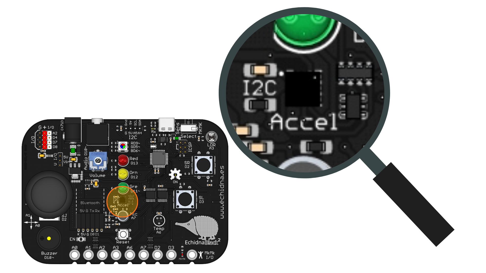
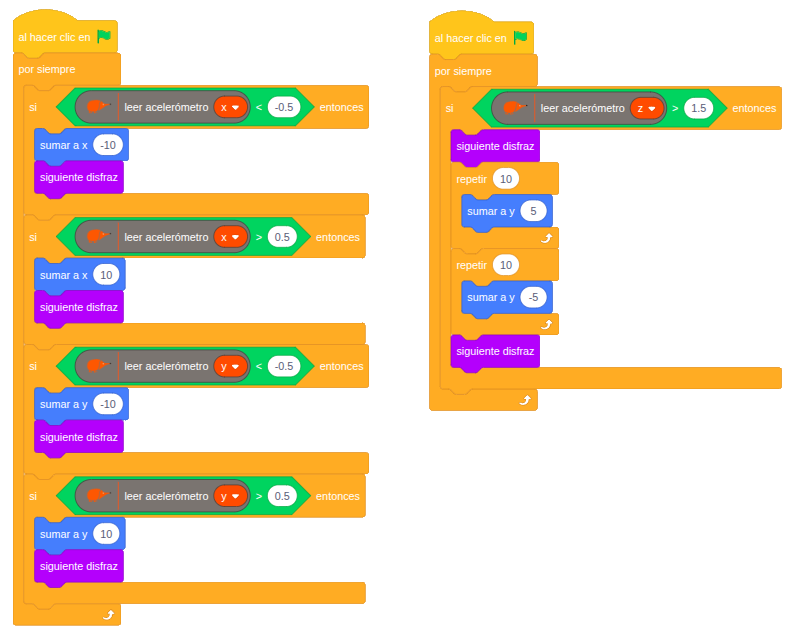

# Movemos el echidna

IMAGEN CABECERA MOVEMOS EL ECHIDNA

--> Video del funcionamiento

## 1. Qué vamos a hacer

Vamos a convertir la placa en un **mando de videojuego**: al **inclinar la placa** hacia un lado, el personaje de Echidna se moverá por la pantalla en esa dirección, y si **levantas la placa de golpe**, el personaje dará un **salto**.

### 1.1 Qué vamos a aprender

* A utilizar el **acelerómetro** para detectar la **inclinación** y los **movimientos bruscos** de la placa.
* A leer los valores de los tres ejes: **X**, **Y** y **Z**.
* A mover un personaje por el escenario usando sus **coordenadas** (`sumar a x` y `sumar a y`).
* A animar un personaje cambiando de **disfraz**.
* A ejecutar dos programas a la vez usando **dos hilos** de ejecución.

### 1.2 Qué componentes vamos a usar

* **Acelerómetro:** Sensor que mide los movimientos de la placa en los tres ejes. Con los ejes **X** e **Y** detecta hacia dónde inclinas la placa, gracias a la fuerza de la gravedad. Con el eje **Z** detecta los movimientos bruscos hacia arriba o hacia abajo.

{ .img-lupa }

Para leer el acelerómetro usamos el bloque `leer acelerómetro`, en el que puedes elegir el eje **x**, **y** o **z**. Estos son los valores que nos da:

* **En reposo:** alrededor de 0 en los ejes X e Y, y alrededor de 1 en el eje Z.
* **Ejes X e Y:** al inclinar la placa, el valor cambia de 0 hasta -1 hacia un lado y hasta 1 hacia el otro.
* **Eje Z:** al mover la placa bruscamente, el valor se aleja mucho de 1.

## 2. Programación

Usaremos el personaje de **Echidna** que aparece en el escenario. El programa tiene **dos hilos** de ejecución, es decir, dos grupos de bloques que empiezan a la vez al hacer clic en la bandera verde y funcionan al mismo tiempo:

* **Hilo de movimiento:** revisa continuamente los ejes X e Y. Si la placa está inclinada, suma o resta 10 a la posición del personaje y cambia de disfraz para que parezca que camina.
* **Hilo de salto:** revisa continuamente el eje Z. Si detecta un movimiento brusco, el personaje sube 50 pasos (10 veces 5) y vuelve a bajar.



**Lógica de programación**:

Hilo de movimiento, el programa revisa continuamente:

```
SI el eje x es menor de -0,5 (placa inclinada a la izquierda):
    --> El personaje se desplaza hacia la izquierda.

SI el eje x es mayor de 0,5 (placa inclinada a la derecha):
    --> El personaje se desplaza hacia la derecha.

SI el eje y es menor de -0,5 (placa inclinada hacia atrás):
    --> El personaje se desplaza hacia abajo.

SI el eje y es mayor de 0,5 (placa inclinada hacia delante):
    --> El personaje se desplaza hacia arriba.
```

Hilo de salto, el programa revisa continuamente:

```
SI el eje z es mayor de 1,5 (placa levantada de golpe):
    --> El personaje salta: sube y vuelve a bajar.
```

Los valores 0,5 y -0,5 actúan como umbrales: si la placa está casi plana, no se cumple ninguna condición y el personaje se queda quieto.

## 3. Mejóralo

Prueba a realizar algunas de estas mejoras en tu proyecto de forma autónoma:

1. **Sin salirse de la pantalla:** Haz que el personaje vuelva al centro del escenario al hacer clic en la bandera verde y que no pueda salirse por los bordes. Pista: usa el bloque `rebotar si toca un borde`.
2. **Salto con efectos:** Haz que, cada vez que el personaje salte, suene el **zumbador** y se encienda el **LED RGB**.
3. **Recoge la comida:** Añade un nuevo objeto (por ejemplo, una hormiga) en una posición al azar. Cuando el echidna lo toque, suma un punto a una **variable** y mueve la comida a otra posición al azar.
