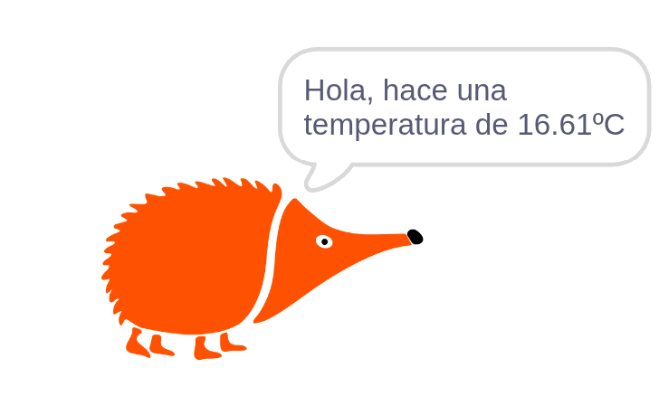
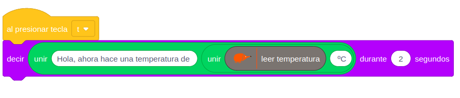

# El echidna dice la temperatura

IMAGEN CABECERA EL ECHIDNA DICE LA TEMPERATURA

--> Video del funcionamiento

## 1. Qué vamos a hacer

<div class="img-text-row" markdown="1">
{ width="300" }

Vamos a convertir a nuestro echidna en un **hombre del tiempo**: cada vez que pulses la tecla **t** del teclado del ordenador, el echidna nos dirá en un bocadillo qué **temperatura** hace, medida con el sensor de la placa.
</div>

### 1.1 Qué vamos a aprender

* A utilizar el **sensor de temperatura** para medir la temperatura ambiente en **grados Celsius** (°C).
* A iniciar un programa al **pulsar una tecla** del ordenador.
* A **unir textos** y valores de un sensor para construir una frase.
* A hacer que un personaje **diga** mensajes en un bocadillo.

### 1.2 Qué componentes vamos a usar

* **Sensor de temperatura:** Mide la temperatura del ambiente. Entrega un voltaje que depende de la temperatura, y el bloque `leer temperatura` lo convierte directamente a grados Celsius.

{ .img-lupa }

Si marcas la casilla que hay junto al bloque `leer temperatura`, verás en el escenario la temperatura medida en cada momento.

## 2. Programación

Usaremos el personaje de **Echidna** que aparece en el escenario. El programa empieza al pulsar la tecla **t**: el echidna dice durante 2 segundos una frase formada con el bloque `unir`, que junta tres partes: el texto "Hola, ahora hace una temperatura de ", el valor del sensor y el símbolo "ºC".



**Lógica de programación**:

```
CUANDO se pulsa la tecla t:
    --> Se lee la temperatura del sensor.
    --> El echidna dice la frase con la temperatura durante 2 segundos.
```

Como dentro de un bloque `unir` solo caben dos partes, usamos un `unir` dentro de otro para juntar las tres.

## 3. Mejóralo

Prueba a realizar algunas de estas mejoras en tu proyecto de forma autónoma:

1. **Sin tantos decimales:** El sensor da la temperatura con decimales (por ejemplo, 16.61). Usa el bloque `redondear` para que el echidna diga solo un número entero.
2. **Grados Fahrenheit:** Haz que el echidna diga también la temperatura en grados Fahrenheit (°F), como en Estados Unidos. Para calcularla, multiplica los grados Celsius por 1.8 y súmale 32.
3. **Alarma de calor:** Programa una alarma que haga sonar el **zumbador** cuando la temperatura supere un valor. Para probarla, calienta el sensor tocándolo suavemente con el dedo y observa cómo sube el valor.
